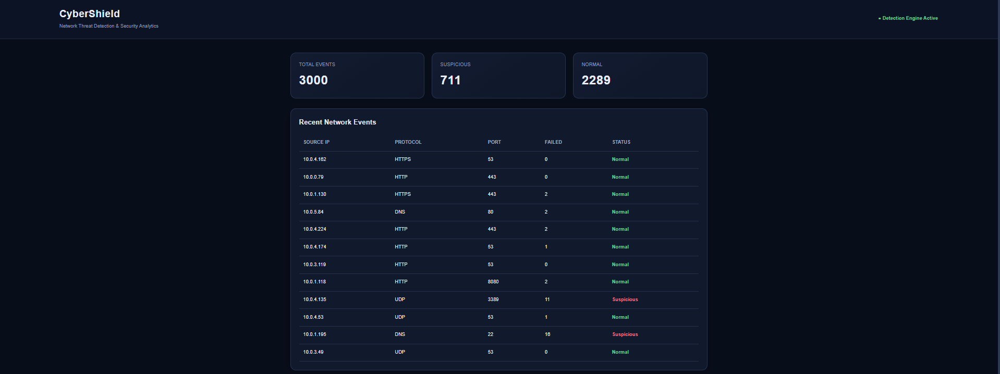

<div align="right">

[1]: https://github.com/AadityaChaudhary-git
[2]: https://www.linkedin.com/in/aaditya-chaudhary-3a322b329/


[][1]
[][2]

</div>

# <div align="center">CyberShield Threat Detection</div>


CyberShield is an **MCA major group project** designed to analyze network activity and identify potentially suspicious network behavior using Machine Learning.

The project combines **Python, SQL, Machine Learning and Flask** to create a complete network threat detection and security analytics system.

**Workflow:**  
Network Logs → Feature Engineering → ML Model → Threat Prediction → Security Alert


## What is Network Threat Detection?

Network threat detection is the process of monitoring network activity to identify unusual or potentially harmful behavior.

Network traffic can contain patterns associated with suspicious activity, such as unusual connection rates, repeated failed connections, abnormal packet activity or connections to sensitive ports.

The goal of CyberShield is to analyze these network patterns and classify network events as **Normal** or **Suspicious**.

The system can help security teams identify potentially risky network events and prioritize them for further investigation.


## Objectives:

- Analysing network traffic and connection patterns.
- Identifying potentially suspicious network activity.
- Using SQL to analyse network security data.
- Applying Machine Learning for threat classification.
- Evaluating the performance of the classification model.
- Generating a risk score for network events.
- Providing a web-based interface for threat analysis.


## Dataset:

The project uses a **synthetic network traffic dataset** created for academic demonstration.

The dataset contains network activity and connection-related features such as:

- Source and destination IP addresses
- Network protocol
- Source and destination bytes
- Connection duration
- Source and destination packets
- Destination port
- Failed connections
- Login attempts
- Connection rate
- Network activity label

The target variable classifies each network event as:

- **Normal**
- **Suspicious**


## Implementation:

**Libraries:** pandas, NumPy, scikit-learn, Matplotlib, joblib

**Technologies:** Python, SQL, Machine Learning and Flask

The project uses a Machine Learning pipeline consisting of preprocessing, feature transformation and classification.

A **Random Forest Classifier** is used for detecting suspicious network activity.


## Few glimpses of the Project:

### 1. Security Dashboard:

> 

The dashboard provides an overview of network activity, including:

- Total network events
- Suspicious events
- Normal events
- Recent network activity
- Network protocols
- Destination ports
- Failed connections
- Threat status


### 2. Network Event Analysis:

> 

CyberShield allows users to enter network activity information and analyze an individual network event.

The Machine Learning model returns:

- Predicted status
- Risk score

For example, a network event can be classified as **Suspicious** when its activity pattern indicates a higher level of risk.


## Machine Learning Model:

The project uses a **Random Forest Classifier** for binary classification.

### Model Workflow:

```text
Network Data
     ↓
Data Preprocessing
     ↓
Feature Engineering
     ↓
Train/Test Split
     ↓
Random Forest Classifier
     ↓
Threat Prediction
     ↓
Risk Score
